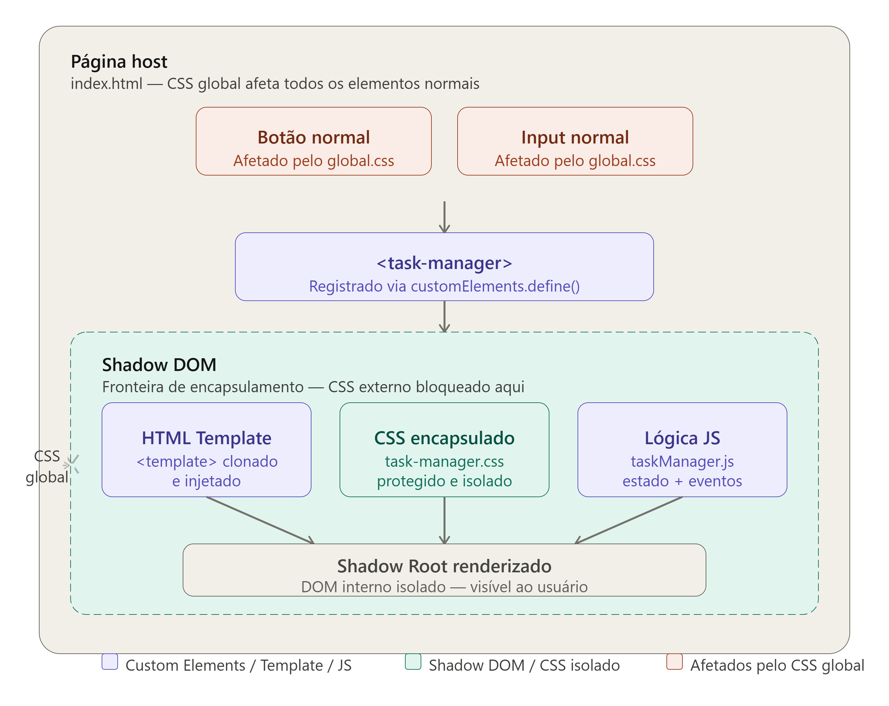
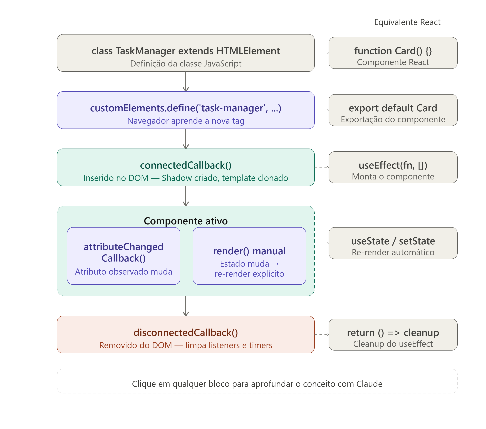

# 🚀 Web Components Nativos

Este repositório contém um trabalho de prospeção tecnológica desenvolvido para a disciplina de Engenharia de Software.

## 🎯 O que é este projeto?

A aplicação simula um ambiente uma página web com CSS global agressivo e injeta um componente customizado: um **Gerenciador de Tarefas** (`<task-manager>`).

O foco principal é a criação do componente nativo e seus conceitos, além de provar o isolamento e o encapsulamento de estilos e comportamentos garantidos pelo **Shadow DOM**, mostrando que o componente não sofre interferência do CSS externo e nem vaza seus estilos para a página principal.

## 🛠️ Tecnologias Utilizadas

- **HTML5** (Templates)
- **CSS3** (Estilização isolada e global)
- **JavaScript (ES6+)** (Classes, Custom Elements API, Event Delegation)
- **Nenhuma biblioteca ou framework de terceiros.**

## 📂 Estrutura de Pastas

A arquitetura do projeto aplica o conceito de _Separation of Concerns_ (Separação de Conceitos), dividindo estilos globais, estilos de componentes e a lógica JavaScript:

```text
prospec-tecnologica/
│
├── index.html                 # Página principal (Host) que consome o componente
├── README.md                  # Documentação do projeto
│
├── style/
│   ├── global.css             # CSS global propositalmente hostil (para testes)
│   └── task-manager.css       # CSS protegido e exclusivo do componente
│
└── components/
    └── taskManager.js         # Lógica da classe, ciclo de vida e Shadow DOM
```

## Diagramas

### Arquitetura do componente


### Ciclo de vida

